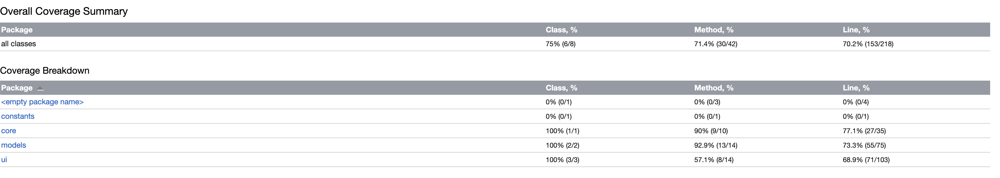

# Testing

### Unit Testing

Unit testing was done to make sure that all the files ran smoothly and there were no bugs in the code. This was done using JUnit, and the unit tests can be found in the testing folder, in the files GameManagerTest and GameTest. By running the tests in IntelliJ IDEA, an HTML testing coverage document is automatically created. The finalized version of the report can be seen below:

However, tests can be run in any IDE, by simply running the files. JUnit then logs which tests have passed, and which tests have failed.

### Performance Testing

All the performance tests that I made were in regard to the AI. Thus, all performance tests can be found in the AITest file. The following aspects of the AI were tested:
* Speed of the AI at varying depths (how fast the move is calculated).
* Accuracy of the AI, which can be broken down into the following sub-categories:
  * Finding a win that only requires one move
  * Finding a win that requires several moves
  * Finding a win at depth 0
  * Finding a win at depth greater than 0
  * Finding defensive moves to prevent a loss

These tests were used to make sure the AI performs as expected, and were also used to find a suitable depth, such that it doesn't take too much time.
The tests can be run through the AITest file. You can change the depth and game boards in the tests to see if the AI can still work as expected.
